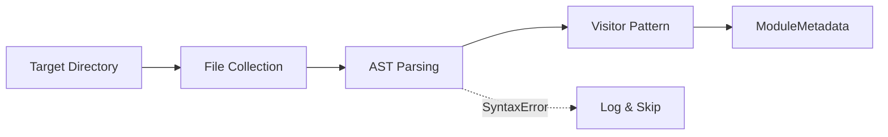
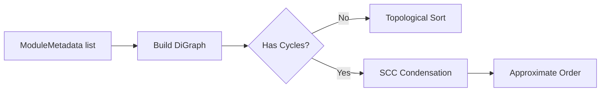
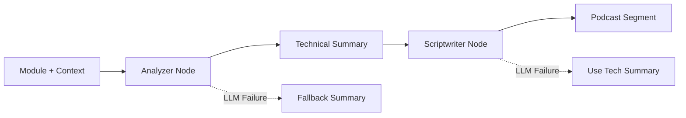
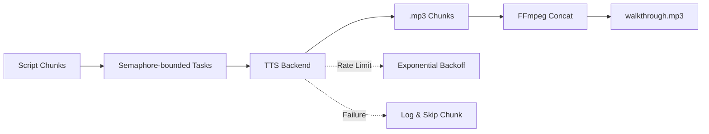

# Pipeline Architecture

The podifyr pipeline executes in four sequential stages, each with independent error handling.

## Stage 1: AST Parsing

**Key decisions:**
- Uses Python's native `ast` module for zero-dependency parsing
- Custom `ModuleVisitor` extracts only structural metadata
- Gracefully skips unparseable files with logged warnings
- Cache layer avoids re-parsing unchanged files

## Stage 2: Dependency Graph

**Key decisions:**
- NetworkX DiGraph maps importer → imported relationships
- Only internal imports become edges (external deps ignored)
- Cycle-aware sorting via Strongly Connected Component condensation
- Graph metrics (density, centrality) inform the script generation

## Stage 3: Script Generation

**Key decisions:**
- LangGraph state machine with two nodes
- Each node has independent fallback logic
- Compiled once, invoked per-module
- Results cached by content hash

## Stage 4: Audio Synthesis

**Key decisions:**
- asyncio with semaphore for bounded concurrency
- Exponential backoff with jitter for rate limit handling
- Pluggable backends via abstract base class
- FFmpeg concat demuxer for lossless stitching
